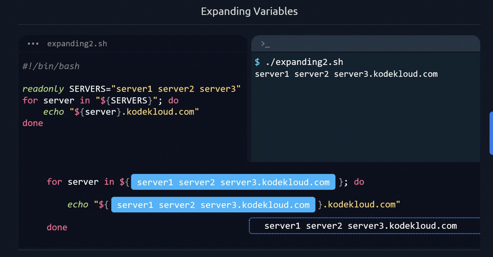
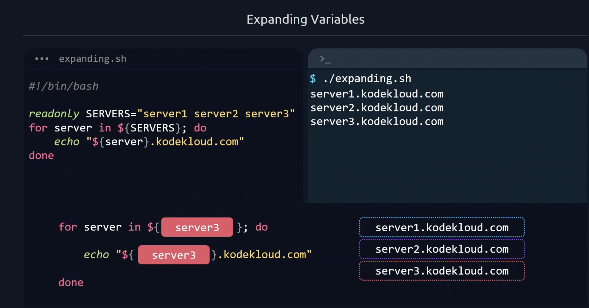

# Shell Scripting

My Shell Scripting Learning

Shell Scripting Notes
---------------------
# Conventions
* Formatting 
* Following Name Conventions 
* Organizing and Structuring
Forementioned things make code readable,maintainable easier to work with
Includes --> variable,class,functions naming
## Variables 
user,user_address use underscores which is known as snake case 
For constants you can name in upper case letter
also `readonly` before name gives more visibility that the value should not be changed
variables that can be used by other scripts you can use export 
exort SOURCE_FILE 
## Functions 
* Always in the lower case and _ in between naming should be descriptive 
function_name() {
spacing and curly brace opening closing should be like this indentation of closing should be as start of function name
}
## Expanding Variables
How will be using the variable in the script 

```bash
  #!/bin/bash
  var="hi"
  echo ${var}
```
```bash
  #!/bin/bash
  var="hi"
  echo $var
```

but lets get another example
```bash
#!/bin/bash
height=170
echo "Your height=$heightcm"
```
will be getting error
```bash
#!/bin/bash
height=170
echo "Your height=${height}cm"
```
So surrounding the name of variable with curly braces is best practice but it can be overlooked for two cases
* Command Line Arguments
* Special Shell Variables
Also use double quotes to have right value of variable 
```bash
"${height}"
```
### Example
```bash
#!/bin/bash
string="one two three"
for element in string ${string};do
echo "${element}"
done
```
Output 
```
one
two
three
```
With Double Quotes
```bash
#!/bin/bash
string="one two three"
for element in string "${string}";do
echo "${element}"
done
```
*"" To be taken as one string*
*{} to concatenate with other*
In Conclusion use double quotes for 
* Filenames,Directory Paths
* Assigning URL to variables
* When in doubt use double quotes
*Note* $ sign can be used with other characters to expand variables
*Example With & Without Quotes*



# Refresher
* We know that bash is imperative type of coding but it is very useful to create your scripts more dynamic so they can be read easily what it is doing also if it fails somewhere give some error or message 
* So make your script in a way it will handle errors and unseen conditions as well
## ScriptFlow
* Execute command on condition bases (if,elif)
* Execute some command again and again (for,while)
*Think like Factory Method* 

So four fundamental constructs which will help us to take it as programming language 
* Functions
* Loops
* Source Code (From other codes)
* Conditional Statements  

## Conditional Statements: 
### if
```bash
if [[ 3 > 4 ]]; then
echo "You will never get this"
fi
```
Using [[]] because it gives more functionality 
### case 
```bash
case word in pattern1)
Statement(s)
;;
pattern2)
Statement(s)
;;
pattern3)
Statement(s)
;;
Default condition to be
executed
;;
esac
```
## Loops
To do things until met some condition or specific number of times
* for (pre-defined)
* while (condition and variable starting point)
* until (condition and variable starting point)


do done are important keywords
* Know exactly how many times we want to repeat the loop
* While is better to loop until a condition is met without knowing how many times it would take
* For reading files, it is better to use While than For
* While runs the loop while the condition is true, and Until runs the loop until the condition is true
